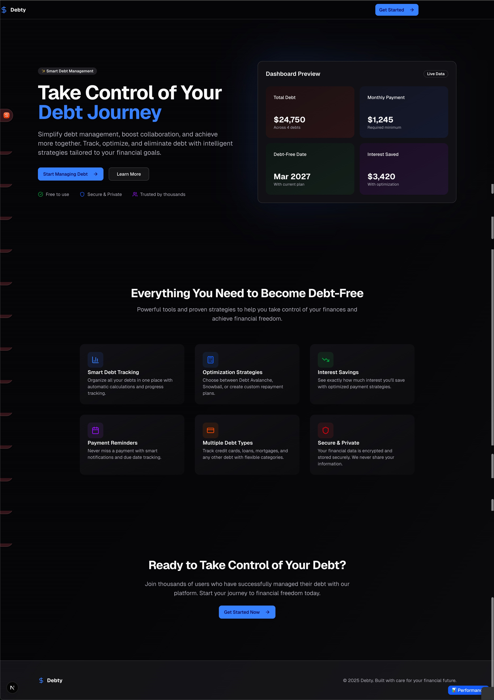

# Debt Tracker



## Overview

Debt Tracker is a powerful, open-source application designed to help you take control of your finances by effectively managing and eliminating debt. Whether you're feeling overwhelmed by multiple debts or you're a financially-savvy individual looking to optimize your repayment strategy, Debt Tracker provides the tools and insights you need to succeed.

This project is not only a practical tool but also a showcase of modern web development practices, built with a focus on type-safety, performance, and user experience.

## ✨ Features

- **Comprehensive Debt Management:** Easily add, track, and manage all your debts in one place.
- **Interactive Dashboard:** Visualize your debt landscape with an intuitive and informative dashboard.
- **Strategic Repayment Plans:** Implement popular debt repayment strategies like the Debt Avalanche and Debt Snowball methods.
- **Payment Tracking:** Log and monitor your payments to see your progress over time.
- **Secure User Authentication:** Your financial data is kept private and secure with Clerk authentication.
- **Modern, Responsive UI:** A clean and modern user interface built with shadcn/ui and Tailwind CSS.

## 📸 Screenshots

| Dashboard Preview | Debt Overview | Strategy Dashboard |
| :---: | :---: | :---: |
|  |  |  |

## 🛠️ Tech Stack

- **Framework:** [Next.js 15](https://nextjs.org/) (with App Router, PPR, and React Compiler)
- **UI:** [shadcn/ui](https://ui.shadcn.com/), [Tailwind CSS](https://tailwindcss.com/), and [Recharts](httpss://recharts.org/)
- **API Layer:** [tRPC](https://trpc.io/) for type-safe client-server communication
- **Authentication:** [Clerk](https://clerk.com/)
- **Database:** [Convex](https://convex.dev/) (migration from [Supabase](https://supabase.com/) in progress)
- **Form Management:** [React Hook Form](https://react-hook-form.com/) with [Zod](https://zod.dev/)
- **Linting & Formatting:** [Biome](https://biomejs.dev/) and [Prettier](https://prettier.io/)

## 🚀 Getting Started

### Prerequisites

- [Bun](https://bun.sh/)
- [Node.js](https://nodejs.org/) (v18 or later)
- A [Clerk](https://clerk.com/) account
- A [Supabase](https://supabase.com/) project

### Environment Variables

Create a `.env.local` file in the root directory and populate it with your credentials. You can use the `.env.example` file as a template.

```bash
# Clerk Authentication (Required)
# Get these from https://dashboard.clerk.com
NEXT_PUBLIC_CLERK_PUBLISHABLE_KEY=pk_test_your_clerk_publishable_key_here
CLERK_SECRET_KEY=sk_test_your_clerk_secret_key_here

# Optional: Clerk Redirect URLs (defaults work if not set)
NEXT_PUBLIC_CLERK_SIGN_IN_URL=/sign-in
NEXT_PUBLIC_CLERK_SIGN_UP_URL=/sign-up
NEXT_PUBLIC_CLERK_AFTER_SIGN_IN_URL=/dashboard
NEXT_PUBLIC_CLERK_AFTER_SIGN_UP_URL=/dashboard

# Supabase (Required)
# Get these from your Supabase project dashboard
NEXT_PUBLIC_SUPABASE_URL=https://your-project-id.supabase.co
NEXT_PUBLIC_SUPABASE_ANON_KEY=your_supabase_anon_key_here
SUPABASE_SERVICE_ROLE_KEY=your_supabase_service_role_key_here
# Convex (Optional)
NEXT_PUBLIC_CONVEX_URL=https://your-deployment.convex.cloud
```

### Installation

1. **Install dependencies:**

    ```bash
    bun install
    ```

2. **Run the development server:**

    ```bash
    bun dev
    ```

3. **Open your browser** to [http://localhost:3000](http://localhost:3000).

## 🤝 Contributing

Contributions are welcome! Please see the [CONTRIBUTING.md](./CONTRIBUTING.md) file for guidelines on how to get started.

## 📜 License

This project is licensed under the MIT License. See the [LICENSE](./LICENSE) file for details.

## 🙏 Acknowledgements

- [shadcn](https://github.com/shadcn) for the amazing UI components.
- The [tRPC](https://trpc.io/) team for making type-safe APIs a breeze.
- The [Clerk](https://clerk.com/) and [Supabase](https://supabase.com/) teams for their excellent services.

## 📦 Migrating to Convex

Work is underway to replace the Supabase database with [Convex](https://convex.dev/). See [docs/convex-migration.md](./docs/convex-migration.md) for progress.

## 👨‍💻 Contributors

A huge thanks to all the contributors who have helped build and improve Debt Tracker!

<!-- ALL-CONTRIBUTORS-LIST:START - Do not remove or modify this section -->
<!-- prettier-ignore-start -->
<!-- markdownlint-disable -->
<!-- Add contributors here -->
<a href="https://github.com/HexSleeves/DebtTracker/graphs/contributors">
  
</a>
<!-- markdownlint-restore -->
<!-- prettier-ignore-end -->
<!-- ALL-CONTRIBUTORS-LIST:END -->
